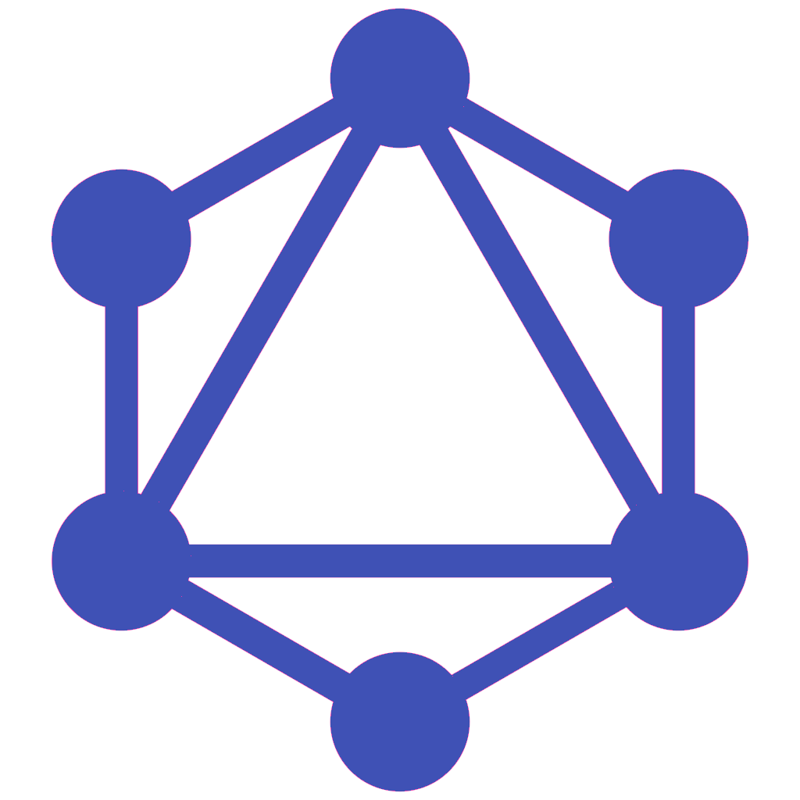

<p align="center">
  <a href="https://github.com/reymon359/full-stack-social-site">
    
  </a>
</p>
<h1 align="center">
  Full Stack Social Site
</h1>

Full Stack Social Site is an Open Source Client-Server social site app.

<p align="center">
  <a href="https://www.youtube.com/watch?v=VIFTRre9T40">
    
  </a>
</p>

## Built With these Technologies

### Client

- **[React](https://reactjs.org/)**: Javascript library for building User Interfaces.
- **[TypeScript](https://www.typescriptlang.org/)**: Type-safe code and other advantages!
- **[Styled-Components](https://styled-components.com)**: Visual design styles.
- **[ApolloClient](https://www.apollographql.com/client/)**: For handling GraphQL queries + caching + local state management.
- **[Jest](https://jestjs.io/)**: Testing Framework.
- **[GraphQL Code Generator](https://graphql-code-generator.com/)**: To automatically generate code from your GraphQL schema.

### Server

- **[PostgreSQL](https://www.postgresql.org/)**: SQL database.
- **[TypeScript](https://www.typescriptlang.org/)**: Type-safe code and other advantages!
- **[ApolloServer](https://www.apollographql.com/server/)**: GraphQLServer.
- **[Jest](https://jestjs.io/)**: Testing Framework.
- **[GraphQL Code Generator](https://graphql-code-generator.com/)**: To automatically generate code from your GraphQL schema.
- **[GraphQL Modules](https://graphql-modules.com/)**: To create an scalable structure.

## Main objective

I made this project for my final thesis of the [Web Engineering Master from the Madrid Polytechnic University](https://www.etsisi.upm.es/estudios/master/miw/ig). The main objective of it was to **learn how apps are being developed nowadays on software engineering, what are the leading technologies and understand them by using them**. 

- [Thesis documentation](./assets/TFM%20Ramon%20Morcillo.pdf)
- [Demo video](https://www.youtube.com/watch?v=VIFTRre9T40&feature=youtu.be)
- [Presentation slides](https://docs.google.com/presentation/d/1iCZCOCMAIpcOxdHlIj04TPLfkBG5AxOnW2dUQH1Q26I/edit?usp=sharing)


## Installing

First you need to install [Node.js](https://nodejs.org/en/) and [PostgreSQL](https://www.postgresql.org/). Then after cloning it have a look at [the scripts](https://github.com/reymon359/full-stack-social-site/blob/67a6d509f66612255c0929d170441fe24240db5f/server/db.ts#L45) to set up the database and then run `npm install` in both, the client and the server directories.

In the client directory you will need to create a `env` file with this variable

```
REACT_APP_SERVER_URL=http://localhost:4000
```

## Available Scripts


## License

This project is licensed under the MIT License

## Author

- **Ramon Morcillo** - [reymon359](https://github.com/reymon359)

## Side Notes
Although the project is far from being finished the main objective has been accomplished, so I do not know if I will keep working on it.
